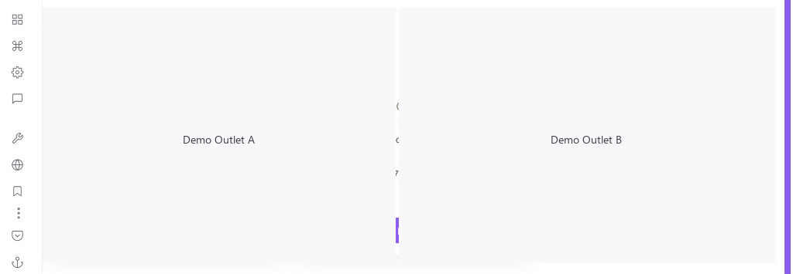
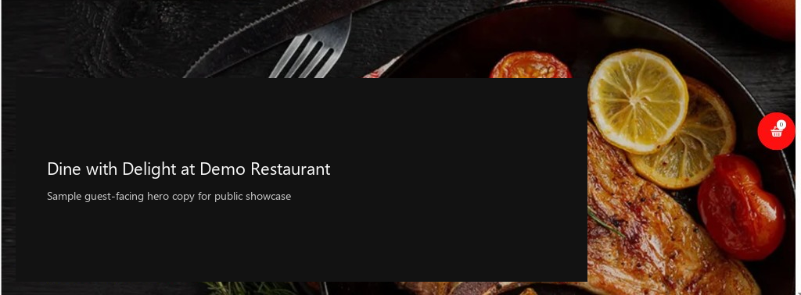
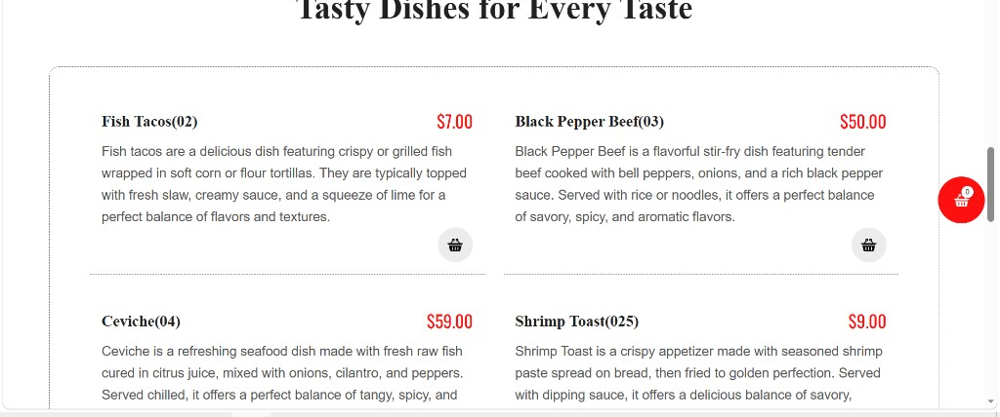
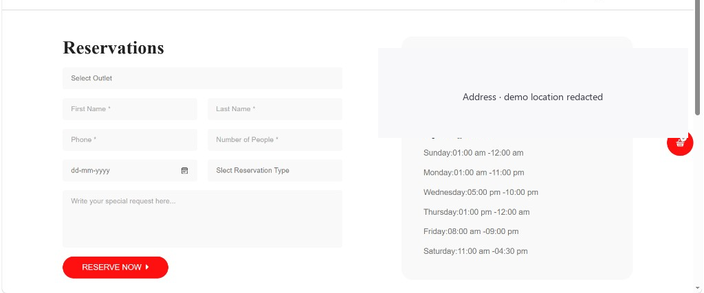
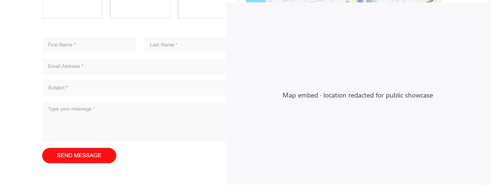
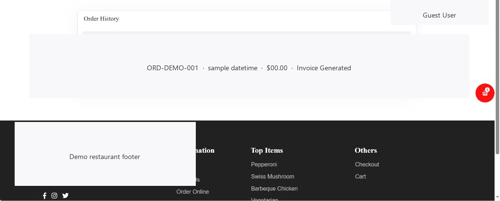
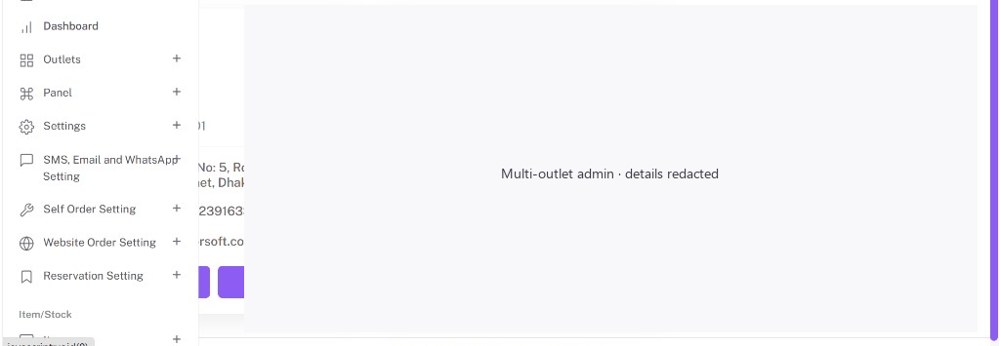

# Opsify Kitchen

### Restaurant POS & Operations Platform — Case Study

Opsify Kitchen is an end-to-end restaurant operations platform that unifies point-of-sale, kitchen workflow, inventory, online ordering, and business reporting into a single multi-outlet system.

This repository is a **public product showcase**. It describes the product, architecture, and engineering approach used in delivery—without exposing production source code or confidential client assets.

---

## Business / Problem Overview

Restaurants often run on fragmented tools: a separate POS, paper or siloed kitchen tickets, ad-hoc inventory tracking, and disconnected online ordering. That fragmentation slows service, increases stock waste, and makes multi-outlet reporting unreliable.

Opsify Kitchen addresses this by giving floor staff, kitchen teams, and managers one operational system—covering order capture through fulfilment, stock control, and commercial reporting.

---

## Solution

A role-based web application that supports:

- **Front-of-house** order taking and billing (POS + cash register)
- **Kitchen and waiter** fulfilment panels with live order status
- **Back-office** menu, inventory, purchasing, expenses, and staff management
- **Guest channels** including online ordering, QR self-order, and reservations
- **Operations at scale** with multi-outlet sessions, white-label branding, and multilingual UI

The platform is delivered as a secure, privately hosted application tailored to restaurant operating models (dine-in, takeaway, delivery, and hybrid).

---

## Key Features

| Area | Capabilities |
|------|----------------|
| **POS & Sales** | Order entry, holds/suspends, split bills, refunds, register open/close |
| **Kitchen Ops** | Kitchen display panels, cooking status, waiter notification workflows |
| **Menu & Floor** | Food menus, categories, modifiers, tables/areas, promotions |
| **Inventory** | Ingredients, stock levels, adjustments, waste, production, transfers |
| **Purchasing** | Supplier management, purchase orders, supplier payments |
| **Customers** | Customer profiles, dues, loyalty reporting |
| **Online & Self-Order** | Public menu/checkout, QR self-order, reservations, order status screens |
| **Payments** | Multi-gateway checkout (card and regional providers) |
| **Printing** | Thermal bill / KOT / invoice printing via a dedicated print bridge |
| **Compliance** | Regional e-invoicing support (ZATCA Phase-2 where required) |
| **Admin** | Roles & access control, attendance, reports, settings, white-label |

A fuller catalogue is available in [FEATURES.md](FEATURES.md).

---

## Technology Stack

| Layer | Technologies |
|-------|----------------|
| **Application** | PHP, CodeIgniter (MVC) |
| **Data** | MySQL / MariaDB |
| **UI** | Server-rendered views, jQuery, AdminLTE / Bootstrap-based admin & POS UI |
| **Payments** | Stripe, PayPal, Razorpay |
| **Messaging** | SMTP email, SMS providers, WhatsApp integrations |
| **Identity (guest)** | Session auth; optional Google / Facebook sign-in hooks |
| **Printing** | ESC/POS thermal printing via local print server |
| **Compliance** | ZATCA e-invoicing integration |
| **API** | REST endpoints for waiter / mobile workflows |
| **i18n** | Multi-language packs (e.g. English, Arabic, French, Spanish, Indonesian) |

Details: [TECHNICAL_OVERVIEW.md](TECHNICAL_OVERVIEW.md)

---

## Architecture Overview

```text
  Staff & Guests (Browser)
           │
           ▼
   Web Application (MVC)
           │
     ┌─────┴─────┐
     ▼           ▼
  MySQL DB    Integrations
              (Payments, Email/SMS/WhatsApp,
               OAuth, E-invoicing, Print Server)
```

Opsify Kitchen is a **monolithic web application** with clear role surfaces (admin, POS, kitchen, waiter, public website) sharing one domain model and database. External systems are integrated through dedicated libraries and configuration—not hard-coded into presentation screens.


See [architecture/](architecture/) for Mermaid diagrams and diagram notes.

---

## Major Integrations

- **Payment gateways** — Stripe, PayPal, Razorpay for online and POS-adjacent checkout flows
- **Communications** — SMTP, SMS, and WhatsApp for operational and customer messaging
- **Social login** — Google and Facebook hooks for guest-facing authentication
- **Thermal printing** — Dedicated print-server bridge for Bill / KOT / Invoice jobs
- **E-invoicing** — ZATCA Phase-2 reporting/clearance where regulatory requirements apply
- **Waiter REST API** — Lightweight endpoints supporting waiter-app style workflows

---

## Technical Highlights

- **Multi-role operational UX** — Distinct interfaces for cashiers, waiters, kitchen, and managers on one codebase
- **Multi-outlet session model** — Staff work in the context of a selected outlet with consistent access control
- **Multi-channel sales pipeline** — Dine-in, takeaway, delivery, online, and QR self-order share core sales logic
- **Near real-time floor sync** — Kitchen/waiter/POS coordination via polling-based AJAX updates (no websocket dependency)
- **Inventory-aware restaurant ops** — Ingredients, waste, production, and transfers tied to day-to-day operations
- **White-label readiness** — Branding (name, logo, favicon) configurable per company deployment
- **Regional compliance path** — E-invoicing integration designed for regulated markets

---

## Screenshots

Sanitized captures from the guest website and admin multi-outlet surfaces live in [`screenshots/`](screenshots/). Private URLs, personal names, vendor contacts, and map locations have been redacted. See [screenshots/README.md](screenshots/README.md) for the full shot list and remaining capture wishlist (POS, kitchen, waiter, inventory, reports).

| Multi-outlet admin | Online home |
|--------------------|-------------|
|  |  |

| Online menu | About |
|-------------|-------|
|  |  |

| Reservations | Contact |
|--------------|---------|
|  |  |

| Order history | Admin navigation |
|---------------|------------------|
|  |  |

---

## Project Outcomes / Value

| Outcome | Value |
|---------|--------|
| **Unified operations** | One system for sales, kitchen, and stock instead of disconnected tools |
| **Faster floor execution** | POS + kitchen + waiter panels reduce handoff friction |
| **Better stock control** | Purchases, adjustments, waste, and transfers improve cost visibility |
| **Additional revenue channels** | Online ordering and QR self-order without a separate stack |
| **Management visibility** | Broad reporting (sales, kitchen performance, tax/Z-report style summaries) |
| **Deployable branding** | White-label and multi-language support for multi-market rollouts |

---

## Documentation Map

| Document | Purpose |
|----------|---------|
| [PROJECT_OVERVIEW.md](PROJECT_OVERVIEW.md) | Problem, users, scope, and delivery framing |
| [FEATURES.md](FEATURES.md) | Feature catalogue by domain |
| [TECHNICAL_OVERVIEW.md](TECHNICAL_OVERVIEW.md) | Architecture, components, integrations, challenges |
| [architecture/](architecture/) | System & application diagrams |
| [screenshots/](screenshots/) | Visual evidence & capture guidelines |

---

## Confidentiality

Production source code is kept private due to client confidentiality and intellectual property requirements. This repository is a public showcase demonstrating the product, architecture, technical capabilities, and development approach.

No credentials, environment variables, private infrastructure details, customer data, or proprietary implementation source are included here.
