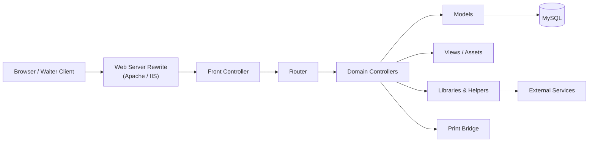
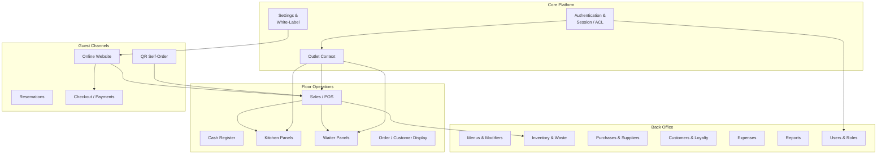

# Application Architecture

Internal module view of the Opsify Kitchen web application.

## Mermaid — Request Flow

## Mermaid — Domain Modules

## Component notes

| Area | Notes |
|------|--------|
| **Core** | Establishes identity, permissions, outlet scope, and branding |
| **Floor ops** | Latency-sensitive UIs; heavy use of AJAX for status updates |
| **Back office** | Master data and commercial controls feeding POS and reports |
| **Guest channels** | Public routes that create or advance orders in the shared sales core |

No proprietary class names, table schemas, or private endpoints are listed here.
