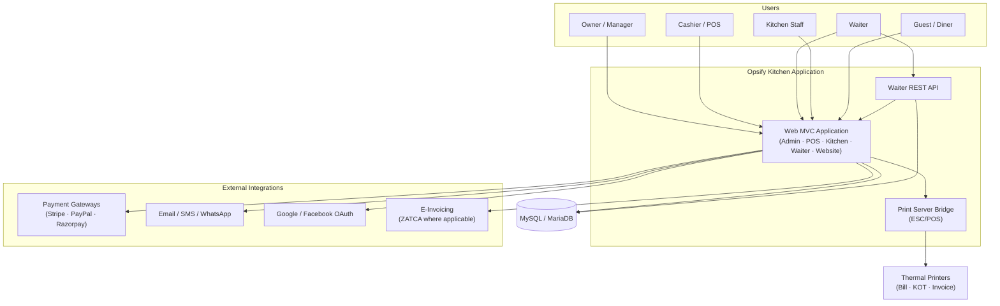

# System Architecture

High-level context diagram for Opsify Kitchen.

## Mermaid

## Narrative

1. Staff and guests access role-appropriate web surfaces.
2. The MVC application persists operational data in MySQL.
3. Waiter companion flows can use REST endpoints in addition to the browser UI.
4. Payments, messaging, OAuth, and e-invoicing are outbound integrations.
5. Printing is delegated to a local ESC/POS bridge that talks to thermal printers.

Static exports: [system-architecture.png](system-architecture.png) · [system-architecture.svg](system-architecture.svg)
